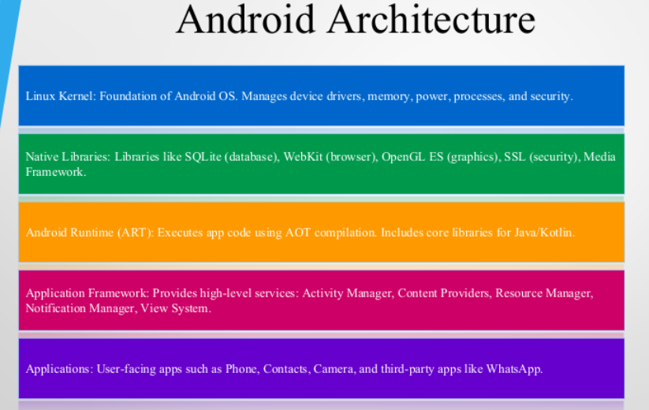

# Week-01

## What is Android?
Android is an open-source mobile operating system developed by Google. It is based on the Linux kernel and powers millions of devices globally including smartphones, tablets, TVs, and wearables.

## Android Architecture

Android architecture of:
    - Linux Kernel: Hardware abstraction
    - Libraries: SQLite, WebKit
    - Android Runtime (ART): Executes app code
    - Application Framework: Activity Manager, Content Providers
    - Applications: Built-in and user-installed apps

| **Layer**               | **Description**          |
|-------------------------|--------------------------|
| **Android Architecture** | Overview of the Android system |
| **Applications**         | User-installed apps running on the device |
| **Application Framework**| Provides high-level services to applications |
| **Android Runtime**      | Includes core libraries and the Dalvik/ART virtual machine |
| **Linux Kernel**         | The underlying operating system kernel |

### Summary

- Android is a powerful mobile OS
- Android Studio is the development environment
- You’ve built and run your first app

### Quiz

- What are the layers of Android architecture?
- How do you install Android Studio?
- What does setContentView() do?

# Week-02 Introduction to Layouts

## Constraint Layout in Android

ConstraintLayout is an advanced layout in Android that enables complex and responsive UIs with a flat view hierarchy, reducing nested views. It is more efficient than LinearLayout and RelativeLayout.

### Important Attributes

- android:id - Unique ID
- layout_constraintTop_toTopOf - Top constraint
- layout_constraintBottom_toBottomOf - Bottom constraint
- layout_constraintLeft_toLeftOf - Left constraint
- layout_constraintRight_toRightOf - Right constraint
- layout_constraintHeight_max/min - Height constraints
- layout_constraintHorizontal/Vertical_weight - Weightattributes

### Implementation Steps

1. Create a new project in Android Studio
2. Add dependency: implementation 'androidx.constraintlayout:constraintlayout:2.2.0'
3. Use ConstraintLayout in activity_main.xml
4. Apply constraints to position views

### Types of Constraints

- Relative Positioning
- Margins
- Bias (0.0 to 1.0)
- Chains (group views linearly)
- Guidelines (invisible alignment lines)
- Barriers (dynamic alignment)

### Advantage

- Drag-and-drop UI design
- Improved performance
- Easier animation integration
- Efficient layout calculation
- Supports complex UI designs

### Disadvantages

- Complex XML code
- Design editor may not match runtime UI
- Requires proper constraints for correct layout
- Separate layout files may be needed for landscape mode

### Comparison with Other Layouts

- LinearLayout: Simple, vertical/horizontal arrangement, slower for complex UIs
- RelativeLayout: Align views by ID, less flexible
- GridLayout: Grid-based, limited flexibility
- ConstraintLayout: Flat hierarchy, flexible constraints, better performance

### Conclusion
ConstraintLayout is a powerful tool for building flexible and efficient Android UIs. Understanding its attributes and constraints enables developers to create responsive designs that adapt to various screen sizes and orientations.

https://www.youtube.com/playlist?list=PLj76U7gxVixQMJ1VB3A9Nak5CN9Fo3_FO

https://www.geeksforgeeks.org/android/constraintlayout-in-android/?authuser=0

# Introduction_to_Layouts_LinearLayout

## Understanding LinearLayout

### LinearLayout Basics
LinearLayout arranges child views in a single vertical or horizontal direction using android:orientation.

### Use Cases for LinearLayout
Ideal for simple UI designs like forms, lists, and toolbars due to its linear stacking of elements.

### Performance Considerations
Nesting multiple LinearLayouts can cause performance issues; ConstraintLayout is better for complex designs.

## ORIENTATION IN LINEARLAYOUT

- Orientation Attribute
android:orientation attribute controls child view arrangement direction, either vertical or horizontal.

- Vertical Orientation
Vertical orientation stacks child views top to bottom, ideal for forms and lists.

- Horizontal Orientation
Horizontal orientation arranges views left to right, perfect for toolbars and navigation menus.

- Combining Orientations
Combining different orientations in nested LinearLayouts creates complex layouts but should avoid deep nesting for performance.

## KEY ATTRIBUTES OF LINEARLAYOUT

### ESSENTIAL XML ATTRIBUTES

- Layout Size Attributes
android:layout_width and android:layout_height define the size of the LinearLayout container.

- Orientation and Weight
android:orientation sets child arrangement direction; layout_weight distributes space proportionally among children.

- Alignment and Baseline
android:layout_gravity aligns children within parent; baselineAligned controls text baseline alignment among children.

### USING LAYOUT_WEIGHT AND WEIGHTSUM

- Layout_weight Function
layout_weight assigns space proportionally to child views based on assigned weight values in LinearLayout.

- WeightSum Role
weightSum defines the total weight for the parent layout to distribute space precisely among children.

- Adaptive UI Design
Using these attributes creates flexible UIs that adjust well to various screen sizes and orientations.

- Best Practices
Proper use avoids unexpected layout behavior and ensures visual balance and usability in applications.

### PRACTICAL IMPLEMENTATION | XML EXAMPLES OF LINEARLAYOUT

- Basic LinearLayout Structure
LinearLayout arranges child views in a single direction, either vertically or horizontally.

- Orientation Attribute
The orientation attribute controls layout direction, switching between vertical and horizontal stacks.

- Layout Weight Usage
layout_weight enables child views to expand proportionally, improving flexible space distribution.

- Alignment and Gravity
layout_gravity controls child view alignment within the LinearLayout for better UI design.

## JAVA AND KOTLIN INTEGRATION

- Accessing Views in Java
Java uses findViewById to reference XML views, enabling dynamic UI manipulation and event handling.

- Accessing Views in Kotlin
Kotlin accesses views similarly with findViewById, providing concise syntax for UI element references.

- Dynamic UI Interaction
Setting properties and event listeners like onClickListener allows interactive and responsive applications.

## BEST PRACTICES AND RECOMMENDATIONS

### OPTIMIZING LINEARLAYOUT USAGE

- Avoid Deep Nesting
Deep nesting of LinearLayouts increases rendering time and reduces app performance
significantly.

- Use ConstraintLayout
ConstraintLayout offers better performance for complex UI designs compared to multiple
nested LinearLayouts.

- Proper Weight Usage
Setting layout_weight and weightSum correctly avoids layout inconsistencies and improves
alignment.

- Testing and Clean Code
Test layouts on different screen sizes and keep XML clean and commented for maintainability.

https://www.geeksforgeeks.org/android/linearlayout-and-its-important-attributes-with-examples-in-android/?authuser=0

https://www.youtube.com/watch?v=ih8etwknjks

# Android Widgets Overview
Introduction to interactive app components on Android devices

### Understanding Android Widgets

- Core Android Widgets
Widgets like TextView, EditText, Button, and ImageView are basic UI components in
Android applications.

- Widget Customization
Android widgets can be customized using attributes like layout size, padding,
margins, and text styles.

- Interactive Functionality
Widgets enable user interaction such as data input and event triggering within
Android apps.

- Custom and Compound Widgets
Developers can create custom widgets by extending or combining multiple widgets
for advanced features.

### TextView | Displaying Text with TextView

- TextView Basics
TextView is a non-editable Android widget used to display static text content.

- Customization Options
TextView supports text size, color, style, gravity, and background customization for flexible UI design.

- Dynamic Text Updates
TextView text can be updated dynamically in code, enabling personalized user messages.

- Advanced Features
Supports multiline text, HTML formatting, clickable links, drawable icons, and padding adjustments.

### EditText

- **Capturing User Input with EditText**

- Versatile Input Types
EditText supports multiple input types like text, number, password, and email for diverse user data entry.

- User Guidance and Customization
Hints, maxLines, textSize, and textColor attributes help guide users and customize EditText appearance.

- Data Retrieval and Validation
Developers retrieve input using getText().toString() and use validation and error messages for accuracy.

- Integration in Interactive Forms
EditText integrates with buttons and text views to create dynamic and interactive Android forms.

### Button

**Triggering Actions with Button**

- Button Basics
Buttons perform actions when clicked and are essential for navigation and form submission in Android apps.

- Customizing Buttons
Buttons can be customized with text, colors, icons, and backgrounds using XML attributes and code.

- Handling Button Events
Developers use android:onClick or setOnClickListener() to define custom behaviors when buttons are pressed.

- Button States and Layout
Buttons support pressed, focused, and disabled states, styled with selectors and aligned in layouts.

# Week3_Introduction_to_Android_Intents

### Working with Intents in Android

**UNDERSTANDING INTENTS IN ANDROID | Working with Intents**

- Purpose of Intents
Intents facilitate communication between app components such as activities, services, and broadcast receivers.

- Types of Intents
Explicit intents target specific components, while implicit intents request general actions handled by system.

- App Integration
Intents enable seamless integration and interaction between different apps and system components.

### EXPLICIT INTENTS

**Using Explicit Intents**

- Definition of Explicit Intents
Explicit intents specify the exact target component to launch within the same Android application.

- Java Code Example
Java uses Intent constructor with current and target activity classes to create explicit intents.

- Kotlin Code Example
Kotlin creates explicit intents similarly using Intent(this, TargetActivity::class.java) and startActivity.

- Importance in App Navigation
Explicit intents enable reliable navigation between app screens and require target activity declaration in manifest.

### Creating Apps with Multiple Activities

- Declaring Activities in Manifest
Each app activity must be declared in the AndroidManifest.xml using the activity tag for proper integration.

- Using Explicit Intents
Explicit intents enable navigation between distinct activities, promoting modular app design and user flow.

- Modularizing App Functionality
Separating features into multiple activities improves code organization and enhances maintainability.

- Activity Lifecycle and Data Passing
Managing activity lifecycle and passing data between activities ensures smooth user experience and app stability.

### IMPLICIT INTENTS

- Concept of Implicit Intents: Implicit intents let Android apps request actions without specifying exact components, enabling flexible system handling.

- Common Use Cases: Typical tasks include opening webpages, sharing content, sending emails, and launching maps using implicit intents.

- Code Example: Example code shows how to create an implicit intent in Java and Kotlin to open a URL in a browser.

- Developer Considerations: Developers must provide enough intent data and declare necessary permissions for intent resolution.

https://www.geeksforgeeks.org/android/implicit-and-explicit-intents-in-android-with-examples/?authuser=0

# Week4_Introduction_to_JetpackCompose_Components

### Jetpack Compose Components

Jetpack Compose provides developers with a modern toolkit for crafting native UIs on Android. This toolkit streamlines UI development through a collection of essential Composables, which facilitate easier creation and significantly improve user experience.

### Basic UI Components

This slide provides an overview of essential UI components that enhance user interaction and visual appeal in applications. Understanding these components is crucial for effective UI design and user experience.

- **Text**
The Text Composable is fundamental for displaying text in your app. It can be customized with various styles, sizes, and colors, making it versatile for different UI layouts.

- **Button**
The Button component allows users to interact with the app. It supports various states and styles, ensuring a responsive and user-friendly interface.

- **Image**
The Image Composable is used to insert pictures in your UI. With support for loading images from resources or networks, it enhances visual appeal significantly.

### Layouts Overview

- Column: Stacks components vertically for lists or stacked layouts.
- Row: Arranges children horizontally for toolbars or navigation bars.
- Box: Allows overlapping components for custom layered effects.

### Advanced UI Components Overview

- LazyColumn: Efficiently displays vertically scrolled lists, rendering only visible items.
- Card: Encapsulates content in a styled container with elevation and rounded corners.
- Scaffold: Provides a layout structure integrating common UI elements for consistency.

### Input Component Overview

- TextField: A TextField captures user text input with features like validation.
- Checkbox: Checkbox allows users to make binary choices with visual feedback.
- Slider: Slider enables users to select values within a continuous range for settings.

### Navigation Components

- NavHost: The NavHost Composable manages navigation within your app.
- Navigation Drawer: This component provides a sidebar for navigation links.
- Bottom Navigation: Bottom Navigation efficiently manages top-level navigation in the app.

### Theming and Styling

- MaterialTheme: A unified style for UI components based on Material Design guidelines.
- Surface: Acts as a background layer styled according to the current theme.
- Modifier: Enhances Composables' behavior and appearance, promoting flexible design.

### Animation Components

- AnimatedVisibility: Enhances user experience with smooth transitions.
- Transition: Creates lively animations between different states.
- Decay Animation: Simulates natural decay through velocity for realistic feedback.

### Accessibility Features
Accessibility features are essential for making applications user-friendly for all users, especially those relying on assistive technologies. Proper implementation enhances usability and fosters an inclusive environment.

- ContentDescription: Every interactive Composable should have a content description for accessibility purposes.
- Modifier Semantics: This allows developers to enhance the accessibility of Composables through additional information.
- Accessible Text Fields: Using proper labeling and attributes ensures that text fields are accessible to all users.

### Streamlining Android UI Development with Jetpack Compose
Jetpack Compose significantly streamlines the UI development process in Android by offering a robust set of Composables. By utilizing various components effectively, developers can create intuitive, modern UIs that enhance user experience and engagement. The ease of implementation and flexibility further empowers Android developers to innovate while adhering to design principles.

- Robust Composables: Jetpack Compose offers a comprehensive set of UI components.
- Intuitive Modern UIs: Efficient use of components results in enhanced user experience.
- Ease and Flexibility: Developers can innovate while following design principles.

https://www.geeksforgeeks.org/android/android-jetpack-compose-tutorial/?authuser=0

# Week4_Introduction_to_JetpackCompose_Android

https://www.geeksforgeeks.org/android/basics-of-jetpack-compose-in-android/?authuser=0

**Overview of Jetpack Compose**

Jetpack Compose is a modern UI toolkit designed for Android, which streamlines the UI development process through a declarative approach using Kotlin. This presentation will explore the advantages of Jetpack Compose, the challenges developers might face, and its fundamental functions, providing a solid foundation for understanding this powerful framework before diving deeper into its applications.

### What is Jetpack Compose?

- Toolkit Overview: Jetpack Compose is a toolkit from Google for building native Android user interfaces.
- Reactive Programming: It offers a reactive programming model, allowing developers to express their UIs concisely.
- Composability Benefits: Composability enables the creation of reusable UI components, leading to organized code.

### Benefits of Using Jetpack Compose

- Declarative Approach: Describes UI components by calling predefined functions.
- Compatibility: Works seamlessly with existing Android views.
- Increased Development Speed: Consolidates XML and Kotlin into a single Kotlin file.
- Idiomatic Kotlin Usage: Leverages the Kotlin language features.
- Easy Maintenance: Maintaining and updating the application becomes straightforward.

### Challenges Solved by Jetpack Compose
- Coupling Issues: Reduces excessive coupling between UI elements and the View Model, minimizing risks of Null Reference errors.
- Single Language: Using Kotlin for both UI components and functionalities avoids the complications of managing multiple languages, enhancing code clarity.
- Dynamic UI: Simplifies dynamic UI updates, making it less error-prone compared to traditional methods that rely heavily on XML layouts.
- Integrated Lifecycle Management: Adapts automatically to changes in the app's lifecycle, making it easier to manage state and UI re-composition.

### Basic Functions of Jetpack Compose

- Composable Function: Denoted by the @Composable annotation, these functions allow UI definitions based on data rather than detailed construction processes.
- Preview Function: Annotated with @Preview, it facilitates UI previews within the IDE, streamlining development without the need for installing an APK.
- Column Function: Stacks UI components vertically with no spacing by using Column() annotation, enhancing layout - organization.

- Row Function: Similar to Column, Row() stacks components horizontally, providing flexible horizontal layouts.
- Box Function: Allows overlapping elements, with Box() positioning children relative to edges, useful for layering UI components.

### More Basic Functions
- Spacer: An empty box for layout spacing control.
- Vertical Scroll: Scrolls UI elements that exceed screen height.
- Padding: Adds white space around components for clarity.
- Lazy List: Efficiently displays large data sets like RecyclerView.

### Revolutionizing Android UI Development with Jetpack Compose
Jetpack Compose revolutionizes Android UI development by simplifying processes, improving code readability, and encouraging a more cohesive use of Kotlin. Its declarative nature and modern approach tackle long-standing challenges in Android development, paving the way for more maintainable and efficient applications. As the community continues to grow and embrace Jetpack Compose, familiarity and best practices will further enhance productivity and innovation in Android app development.

- Simplified Development | Declarative Approach | Community Growth